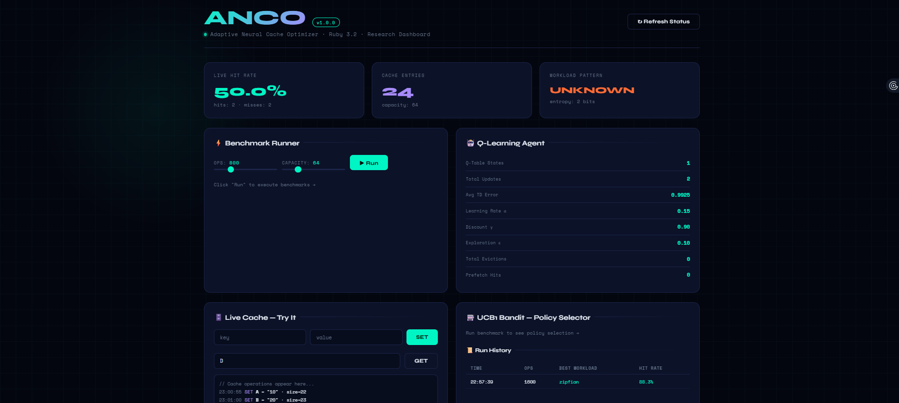

# 🚀 Adaptive Neural Cache Optimizer (ANCO)

ANCO (Adaptive Neural Cache Optimizer) is an intelligent caching system that leverages Reinforcement Learning (Q-Learning) and Multi-Armed Bandit algorithms to dynamically optimize cache performance.

---

## 📌 Features

* 🔄 Real-time Cache Simulation (SET / GET)
* 📊 Interactive Dashboard with Metrics
* 📈 Benchmarking for Different Workloads
* 🤖 Q-Learning based Cache Optimization
* 🎯 UCB1 Bandit Algorithm for Policy Selection
* 🧠 Adaptive behavior based on access patterns
* 📜 Run History Tracking

---

## 🛠️ Tech Stack

* Backend: Ruby (Sinatra)
* Frontend: HTML, CSS, JavaScript
* Algorithms:

  * Q-Learning (Reinforcement Learning)
  * Multi-Armed Bandit (UCB1)
* Visualization: Charts (JS)

---

## ▶️ How to Run Locally

### 1. Clone the repository

```bash
git clone https://github.com/your-username/adaptive-neural-cache-optimizer.git
cd adaptive-neural-cache-optimizer
```

### 2. Install dependencies

```bash
bundle install
```

### 3. Run the server

```bash
ruby server.rb
```

### 4. Open in browser

```
http://localhost:4567
```

---

## 📊 Example Output

| Operation | Key | Result | Value |
| --------- | --- | ------ | ----- |
| SET       | A   | Stored | 10    |
| GET       | A   | HIT    | 10    |
| GET       | D   | MISS   | -     |

**Hit Rate = 66.67%**

---

## 📸 Screenshots

### 🔹 Dashboard View




---

## 🧠 How It Works

* The system stores frequently accessed data in cache.
* Q-Learning improves eviction and prefetch decisions over time.
* Bandit algorithm selects the best caching policy dynamically.
* Performance is evaluated using hit rate and workload patterns.

---

## 📈 Workloads Tested

* Zipfian Distribution
* Sequential Access
* Random Access
* Temporal Locality
* Mixed Workload

---

## 🌐 Deployment

This project is backend-based (Ruby/Sinatra), so it cannot be directly deployed on Vercel.

### ✅ Supported Platforms:

* Render

---

## 👨‍💻 Author

**Yash Jain**

---

## 📜 License

MIT License
